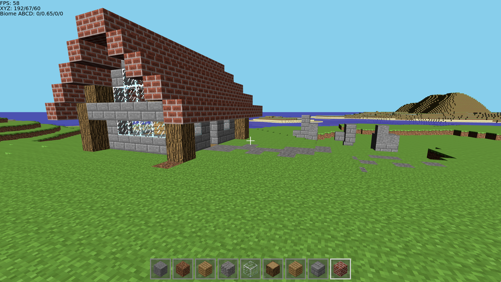

# Blocky
## What is Blocky?
Blocky is a game inspired by Minecraft. Currently, it features dynamically rendered chunks, destroying any block and placing few blocks, walking, sprint, flying and collisions. The goal is to make it as playable as Minecraft in its beta version. 

*You can play it in your browser! No installation required!* [https://domintech.ddns.net/apps/BlockyWorld](https://domintech.ddns.net/apps/BlockyWorld/index.html)

